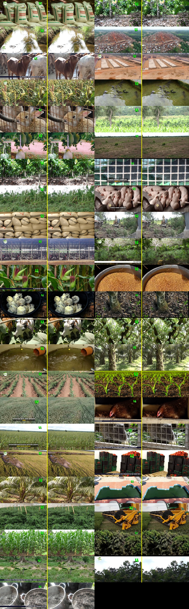

# Ayekoo dataset pipeline

Turn a YouTube video collection into a clean, captioned still-image corpus for
image-generation training: download videos → extract sharpest frames → drop
frames with people → detect watermarks/logos/lower-thirds with Gemini → inpaint
the overlays with LaMa → assemble a captioned dataset and publish it to the
HuggingFace Hub.

<p align="center">
  
  <br><em>Left: raw frame with watermark & lower-third. Right: LaMa-inpainted result.</em>
</p>

---

## Pipeline at a glance

| # | Stage | Script(s) | Output |
|---|-------|-----------|--------|
| 1 | **Download** videos | `pipeline/download/download.sh` (or `local_resolve.sh` + `h200_url_download.py` for IP-blocked hosts) | `videos/<id>.mp4`, `archive.txt` |
| 2 | **Extract** sharpest frames | `pipeline/extract/extract_frames.py` (launch: `pipeline/start.sh`) | `images/<id>/*.jpg`, `metadata.csv` |
| 3 | **Consolidate** frames | `pipeline/extract/consolidate_frames.sh` | flat `frames/` + `metadata.csv/parquet` |
| 4 | **People filter** | `pipeline/people_filter/filter_people_qwen.py` (GPU, Qwen2.5-VL) or `filter_people.py` (CPU, YOLO) | `no_people/`, `people/`, `people_filtered.csv` |
| 5 | **Overlay detect + caption** | `pipeline/overlay_detect/gemini_detect.py` | `gemini_detections.jsonl` (boxes, drop flag, caption) |
| 6 | **Masks** | `pipeline/inpaint/make_masks.py` | `masks/*.png`, `inpaint_input/` |
| 7 | **Inpaint** overlays | `pipeline/inpaint/run_inpaint.py` (LaMa) | `inpainted/*.jpg` |
| 8 | **Assemble** final dataset | `pipeline/finalize/build_dataset.py` | `final_dataset/` + `metadata.csv/parquet` |
| 9 | **Publish** | `pipeline/finalize/upload_to_hf.py` | `https://huggingface.co/datasets/ghanaopenai/ayekoo` |

`pipeline/inpaint/after_gemini.sh` chains stages 6–8 automatically once the
Gemini run writes its `DONE processed=` line.

```
videos ──► frames ──► no_people ──► [Gemini: boxes+drop+caption] ──► masks ──► inpainted ──► final_dataset ──► 🤗
                     (Qwen)                gemini_detections.jsonl     (LaMa)
```

## Repository layout

```
pipeline/
  start.sh  stop.sh  status.sh  remote-status.sh   # drivers
  download/     download + residential-IP workarounds
  extract/      sharpest-frame extraction & consolidation
  people_filter/ Qwen2.5-VL (GPU) and YOLO (CPU) people filters
  overlay_detect/ Gemini overlay/box detection + captions
  inpaint/      mask building + LaMa inpainting
  finalize/     dataset assembly, HF upload, monitors
extras/         experimental helpers + the standalone yt-split-downloader package
examples/       example urls.txt / playlist.tsv
docs/           pilot contact sheets and the pipeline report
```

## Requirements

- Python 3.10+ and, on the GPU host, a single CUDA GPU (developed on an H200).
- System tools: `ffmpeg`/`ffprobe`, `yt-dlp`, `aria2c`, `rsync`, `tmux`, `df`.
- Python packages: `pip install -r requirements.txt`.
- A Gemini API key (Google AI Studio) for stage 5.

## Configuration

Copy `config.example.env` to `config.env` and export it; every script falls back
to the defaults shown there:

```bash
cp config.example.env config.env     # edit paths / host / repo ids
set -a; . ./config.env; set +a
```

| Variable | Meaning |
|----------|---------|
| `AYEKOO_PROJECT_DIR` | Data root (videos/, frames/, no_people/, masks/, inpainted/…). |
| `AYEKOO_REMOTE_DIR` | Same path as seen from the SSH host used by the download helpers. |
| `AYEKOO_REMOTE_HOST` | SSH alias of the GPU/download host (default `h200`). |
| `AYEKOO_STAGE_DIR` | Local staging dir for the residential-IP downloader. |
| `HF_HOME` | Cache for the Qwen vision models. |
| `AYEKOO_GEMINI_MODEL` | Gemini model (default `gemini-3.5-flash-lite`). |
| `AYEKOO_HF_REPO` | HuggingFace dataset repo (default `ghanaopenai/ayekoo`). |
| `HF_TOKEN` | HuggingFace write token (never commit). |

The Gemini key is read from `$AYEKOO_PROJECT_DIR/.secrets/gemini_key` (not stored
in code).

## Usage

### 1–3 · Videos → frames

```bash
export AYEKOO_PROJECT_DIR=/data/ayekoo
mkdir -p "$AYEKOO_PROJECT_DIR"; cp examples/urls.txt "$AYEKOO_PROJECT_DIR/urls.txt"

pipeline/start.sh                       # starts downloader + extractor in tmux
pipeline/status.sh                      # progress
pipeline/stop.sh                        # stop

# once videos are in:
bash pipeline/extract/consolidate_frames.sh "$AYEKOO_PROJECT_DIR"
```

If the download host has a datacenter IP that YouTube blocks, resolve URLs on a
residential machine and hand them to the worker:

```bash
bash pipeline/download/local_resolve.sh      # on the trusted-IP machine
python pipeline/download/h200_url_download.py # on the worker (aria2c)
```

### 4 · People filter

```bash
# GPU (recommended, stricter: body parts count as people)
bash pipeline/people_filter/run_people_qwen.sh "$AYEKOO_PROJECT_DIR"
# CPU alternative
bash pipeline/people_filter/run_people_filter.sh "$AYEKOO_PROJECT_DIR"
```

### 5 · Overlay detection + captions

```bash
echo -n "$GEMINI_API_KEY" > "$AYEKOO_PROJECT_DIR/.secrets/gemini_key"; chmod 600 "$AYEKOO_PROJECT_DIR/.secrets/gemini_key"
python pipeline/overlay_detect/gemini_detect.py \
  --model gemini-3.5-flash-lite --workers 16 \
  --out gemini_detections.jsonl
```

For every frame Gemini returns a JSON record with:

- `boxes`: bounding boxes `[ymin, xmin, ymax, xmax]` (0–1000) labelled
  `watermark | logo | lower_third_text | graphic_overlay`;
- `drop` + `drop_reason` (`person | graphic | low_resolution | none`);
- `caption`: one grounded English sentence, informed by the source video
  title/URL (`video_title`, `video_url` from `metadata.csv`).

The run is resumable (already-processed `image_id`s are skipped) and retries
`429`/`5xx` with backoff. To review boxes, add `--overlay-dir overlays/`.

### 6–8 · Inpaint + assemble

```bash
# one-shot: waits for Gemini DONE, then masks → LaMa → final_dataset
bash pipeline/inpaint/after_gemini.sh

# or step by step
python pipeline/inpaint/make_masks.py --detections gemini_detections.jsonl
python pipeline/inpaint/run_inpaint.py --input-dir inpaint_input --masks-dir masks --output-dir inpainted
python pipeline/finalize/build_dataset.py --detections gemini_detections.jsonl --inpainted-dir inpainted --out-dir final_dataset
```

`build_dataset.py` keeps every `drop=false` frame, using the inpainted copy when
one exists and the original otherwise, and writes `final_dataset/metadata.csv`
with: `image_id, image_filename, relative_path, video_id, video_title,
video_url, timestamp_seconds, caption, had_overlay, overlay_inpainted, n_boxes`.

### 9 · Publish to HuggingFace

```bash
export HF_TOKEN=hf_xxx
python pipeline/finalize/upload_to_hf.py --repo-id ghanaopenai/ayekoo
# → https://huggingface.co/datasets/ghanaopenai/ayekoo
```

## Notes and gotchas

- **Datacenter IPs** are often blocked by YouTube; use the residential-IP
  resolver path (`extras/yt-split-downloader/` or `local_resolve.sh`).
- **LaMa** is used via `simple-lama-inpainting` (`big-lama.pt`). IOPaint pins an
  old Pillow and does not build on Python 3.12.
- The `graphic_overlay` box is what makes LaMa fill the **whole** lower-third
  rectangle (not just the glyphs); it is unioned with the text/logo boxes.
- `refine_boxes.py` is an optional geometric post-process; the Gemini
  `graphic_overlay` box is the primary mechanism.
- Keep `.secrets/`, `cookies.txt`, `HF_TOKEN` and API keys out of git.

## License

MIT © [Ghana Open AI](https://huggingface.co/ghanaopenai). Supported by
[Ghana NLP](https://ghananlp.org). See [LICENSE](LICENSE).
